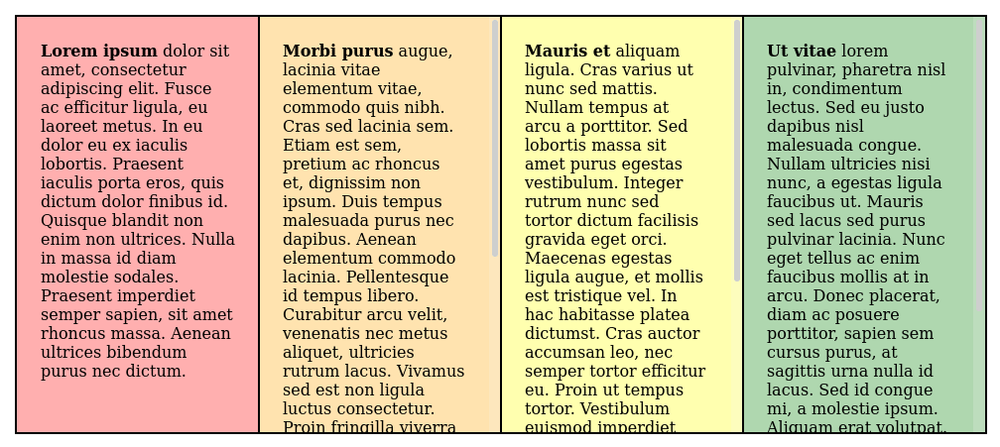

# Intro

`vue-resizeable-frame` is a frame component for Vue 3 that's somewhat similar to [`<frame>`](https://developer.mozilla.org/en-US/docs/Web/HTML/Element/frame).



# Installation

```bash
npm install --save https://github.com/jrc03c/vue-resizeable-frame
```

# Usage

In the JS entry file:

```js
const { createApp } = require("vue")
const VueResizeableFrame = require("vue-resizeable-frame")

const app = createApp({
  // ...
})

app.component("vue-resizeable-frame", VueResizeableFrame)
app.mount("...")
```

In a template:

```html
<template>
  <vue-resizeable-frame
    orientation="horizontal"
    :slots="2"
    :sizes-as-percents="[0.25, 0.75]"
    :min-size-percent="0.1"
    separator-styles="background-color: red; width: 8px; left: -4px;"
    :grab-size-pixels="24"
    panel-styles="background-color: blue;">
    <template v-slot:slot0>This is the first panel!</template>
    <template v-slot:slot1>This is the second panel!</template>
  </vue-resizeable-frame>
</template>
```

# Props

| Prop                    | Description                                                                                                                                                     |
| ----------------------- | --------------------------------------------------------------------------------------------------------------------------------------------------------------- |
| **`slots`**             | **(required)** the number of panels to create                                                                                                                   |
| **`orientation`**       | "vertical" or "horizontal"                                                                                                                                      |
| **`sizes-as-percents`** | an array of sizes for each panel as percents (between 0 and 1); is mutually exclusive with the `sizes-as-pixels` prop                                           |
| **`sizes-as-pixels`**   | an array of sizes for each panel in pixels; is mutually exclusive with the `sizes-as-percents` prop                                                             |
| **`min-size-percent`**  | the minimum size of a panel as a percent (between 0 and 1); is mutually exclusive with the `min-size-pixels` prop                                               |
| **`min-size-pixels`**   | the minimum size of a panel in pixels; is mutually exclusive with the `min-size-percent` prop                                                                   |
| **`grab-size-pixels`**  | the thickness of the panel separator (invisible) grab area; is not related to and has no effect on the visible portion of the separator                         |
| **`separator-styles`**  | a CSS string of extra styles to be applied to the visible portion of each separator; is not related to and has no effect on the grabbable area of the separator |
| **`panel-styles`**      | a CSS string or array of CSS strings to be applied to the panels                                                                                                |
